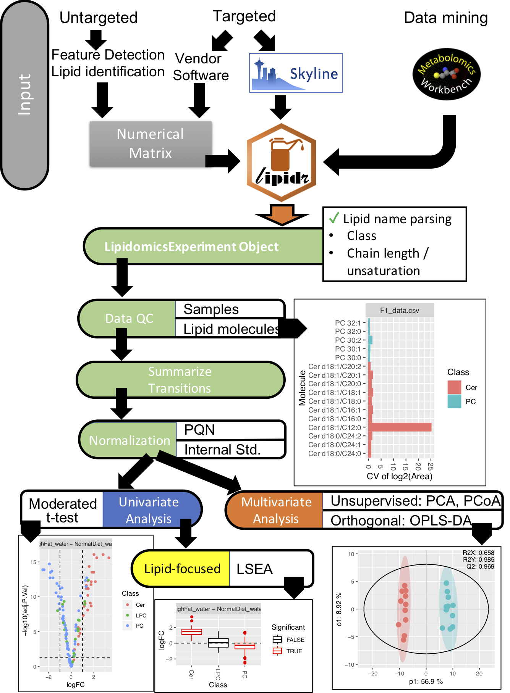

# lipidr 

[](https://travis-ci.org/ahmohamed/lipidr)
[](https://codecov.io/github/ahmohamed/lipidr?branch=master)
[](https://ci.appveyor.com/project/ahmohamed/lipidr)
[](https://bioconductor.org/packages/lipidr/)

# Analysis workflow for targeted lipidomics.

[Full guide at lipidr.org](https://www.lipidr.org/)

## Overall workflow



## Input
`lipidr` implements a series of functions to facilitate inspection,
analysis and visualization of targeted and untargeted lipidomics datasets. `lipidr` takes exported Skyline CSV or a numerical matrix as input, allowing for multiple methods to be analyzed together. Sample annotations, such as sample group or other clinical information can be easily loaded as a CSV file or a data frame.

## LipidomicsExperiment Object
`lipidr` represents lipidomics datasets as a LipidomicsExperiment, which extends [SummarizedExperiment](http://bioconductor.org/packages/SummarizedExperiment/), to facilitate integration with other Bioconductor packages. 

## Quality control & plotting
`lipidr` generates various plots, such as box plots or PCA, for quality control of samples and measured lipids. Lipids can be filtered by their %CV.  Normalization methods with and without internal standards are also supported.

## Univariate Analysis
Univariate analysis can be performed using any of the loaded clinical variables, which can be readily visualized as volcano plots. Multi-group comparisons and adjusting for confounding variables is also supported (refer to examples on [www.lipidr.org]()). A novel lipid set enrichment analysis is implemented to detect preferential regulation of certain lipid classes, chain lengths or saturation patterns. Plots for visualization of enrichment results are also implemented.

## Multivariate Analysis
`lipidr` implements PCA, PCoA and OPLS(DA) to reveal patterns in data and discover variables related to an outcome of interest. Top associated lipids as well as scores and loadings plots can be interactively investigated using `lipidr`.

# Install `lipidr`
## From Bioconductor
In R console, type:

```r
if (!requireNamespace("BiocManager", quietly=TRUE))
    install.packages("BiocManager")
BiocManager::install("lipidr")  
```

## Install development version from Github
In R console, type:

```r
library(devtools)   
install_github("ahmohamed/lipidr")
```

